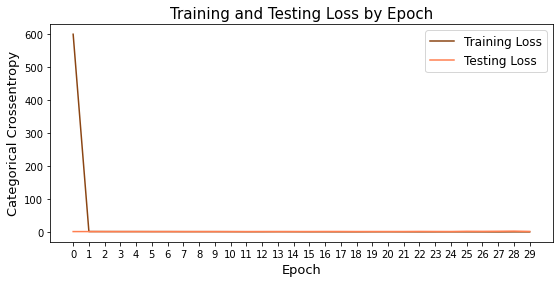
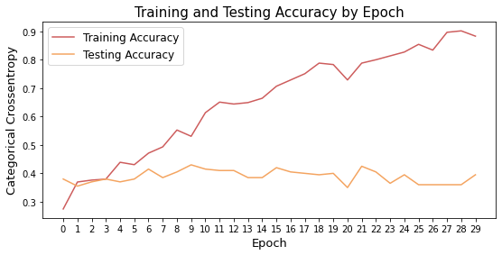
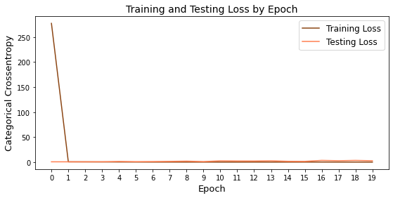
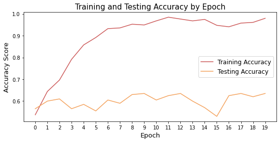
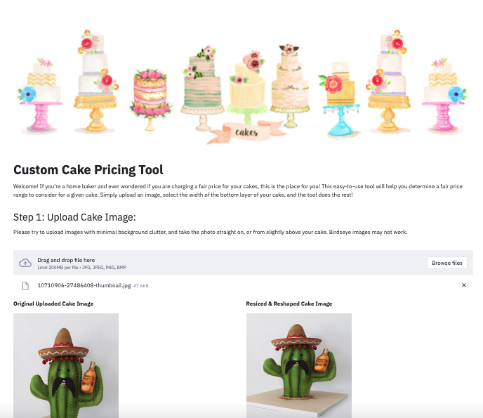

# **Cake Pricing Tool**

## Table of Contents

- [Introduction](#intro)
    - [The Challenge](#challenge)
    - [The Solution](#solution)
- [The Data Science Process](#ds_proc)
    - [Image Collection](#collect)
    - [Image Pre-Preprocessing](#process)
    - [Modeling](#modeling)
        - [Battle of the Starter Models](#planA)
        - [Fine Tuning Production Models](#planB)
    - [Evaluation](#eval)
- [Next Steps & Future Work](#conclusions)
- [Acknowledgements & Thanks](#thanks)

## Introduction

Over the last decade, shows like The Great British Baking Show, Cake Boss, Ace of Cakes and Cake Wars have captured the hearts of millions of viewers, and drawn our attention to a level of cake design and artistry most people associated only with wedding cakes in the past.

This has led to a growing number of home bakers entering the cake decorating market. Some are classically trained pastry chefs who choose to work from their homes rather than for a retail or commercial bakery. Others are artists drawn to the medium of cake as a new canvas for their creativity. Some are moms looking to run a small business from home as they raise their kids.

### The Challenge

But what many of these home bakers have in common is a level of uncertainty about how they should price their cake creations. Professional bakeries are at the high end of the market while grocery stores and Costco are at the low end. Home bakers should be between these ranges, but closer to the professional end of the spectrum. In general, their designs, skills and artistry are on par with professional bakeries, but they can price their cakes a little lower due to lower costs and overhead, yet still make a nice profit.

### The Solution
The goal of this project is to use image recognition models as the foundation for a cake pricing app that would suggest a price range for a cake based on an uploaded image.

## The Data Science Process

### Image Collection
No existing image set of professional cakes exists that I could find, so I decided to build my own dataset to train my models. I started with cakes from my own home business, then asked for cakes from fellow home bakers and also downloaded cake images from the internet.

In the end, I collected 400 cake images with a variety of levels of complexity and skill, styles and designs, sizes and shapes.

### Image Pre-Processing

Image preprocessing involved 5 steps:
1. Image classification - determining whether a cake is 1 tier, 2 tiers, 3+ tiers or a sculpted cake (one designed to look like something else). Then determine the level of difficulty in the design, either simple or complex.
2. Image Resizing - All images were resized using Open CV to 400x400 in order to load into a Convolutional Neural Network model.
3. Image Augmentation - Because of my small training set, after resizing I duplicated all of my images and flipped them to be a mirror image of the original. This served to double my image set from 400 to 800 images.
4. Train-Test-Split - After all processing, I split my images 75% for training and 25% for testing. I also added a validation set of 22 cakes in addition to the original 800.
5. Batching - I used Keras' Image Data Generator to import and classify my images in batches to feed into my model.

### Modeling

#### Plan A
My initial modeling plan was to feed in my 8 classes of cakes to a single CNN model. 4 tier/shapes x 2 complexity levels = 8 classes. Unfortunately, this model performed very poorly, and did not improve with any measures to reduce overfitting or improve accuracy. I determined that with only 800 images and 8 classes, which were not all balanced, the model was having a very hard time learning my classes, so I decided on a different approach.

#### Plan B
For my second pass, I split out cakes first by their number of tiers or shape and built a CNN model with 4 classes. Then I built a second CNN that predicted just 2 classes - simple or complex.

Both models started with two Conv2D layers with MaxPooling layers after, then a Flatten layer followed by Dense and Dropout layers, and a final Dense layer with softmax activation for multi-classification.  

### Evaluation & Analysis

While the separate models performed better than the original combined model, both still struggled with significant overfitting and wide variance in categorical cross-entropy loss between training and testing data.

#### Tier/Shape Model Results:

#### Complexity Level Model Results:

The tier/shape model has a bias toward the majority class which is 1 Tier cakes, 36% of my dataset, and Sculpted Cakes, 23% of my data. I suspect that the model had a hard time learning 2-tier and 3-tier cakes due to low sample sizes, so it categorized almost any tiered cake as 1-tier, and then anything that doesn't look like a tiered cake as Sculpted.

The type model has a slight bias toward Complex cakes, as that was the majority class in my image set, at 57% of all images.

In order to make significant improvements in the accuracy of these models, I've concluded that more image data is imperative.

## Cake Pricing Tool App

Despite the models not performing as strongly as I would like, I did move forward with the app, to get a proof of concept and MVP in place.

Using Streamlit, I developed a python script that incorporated all the app code, my image pre-processing code, my saved TensorFlow models and a pricing look-up table. The app walks the user through there steps:

1. Upload a cake image
2. Set the base size of the cake (something my models cannot detect)
3. Get the recommended price!

After a user uploads and image and selects the base diameter of the cake, the image is run through both models. The two predicted model classes and the base dimension are then used to look up the suggested price range for a cake with those characteristics. The low and high range is returned to the user as the suggested price.

The app is functional, however the recommended prices are subject to the inaccuracies and biases in the models. In general, the model is underpricing cakes based on tier/shape, but overpricing cakes based on complexity, so oddly the price ranges aren't that far off on average.

## Next Steps & Future work

Ultimately, gathering more images data is the biggest opportunity, and challenge, for improving this project. Balancing the classes and increasing the overall quantity of training, testing and validation images should dramatically improve the predictive power of the models, and in turn produce more accurate and reliable price recommendations in the app.

In addition, I want to explore other classification methods in addition to tiers/shape and complexity, or look for ways to be more nuanced in those classes. Options include adding 4 and 5 tier cakes as their own classes, topsy-turvy cakes as their own class, and dividing cake complexity into subgenres such as 3D flowers, fondant characters, hand painting, lace and lattice work, buttercream flowers and succulents, etc.

Finally, I want to continue tapping into the incredible network of home bakers to guide my work and develop a tool that is helpful for the entire community.  

## Acknowledgements & Thanks

For sharing cake photos and pricing models:
Kira Helm
Jennie Mendez, Moonlight Cakes
Josey Fountain, JoseyCakes
Jenn Romero, Sweet Justice Cakes

Charlie Rice, John Hazard, Hov Gasparian and Prasoon Karmacharya for advice, guidance and untangling along the way.

Thank you!
